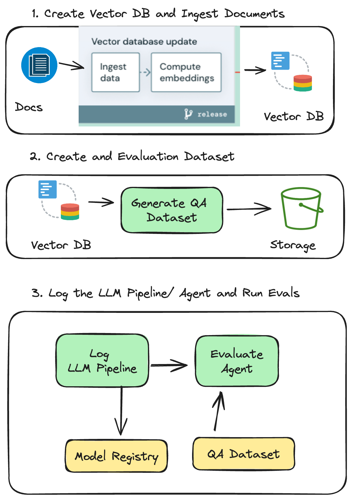
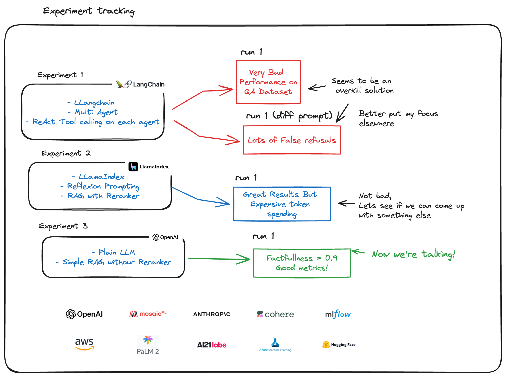
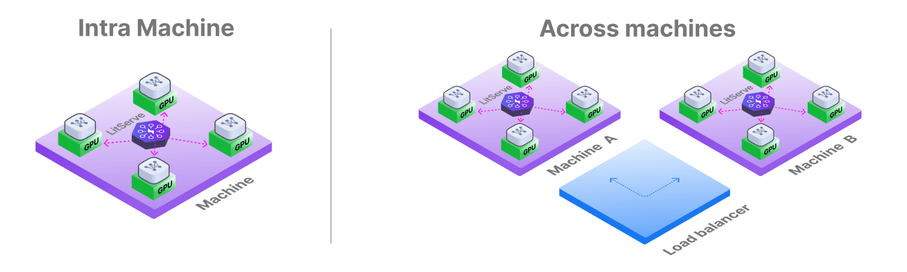
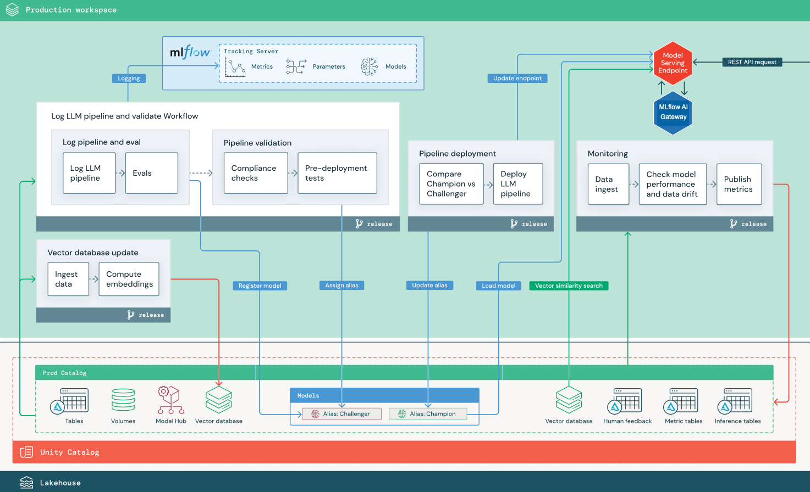

# LLMOps Python Pacakge

[](https://github.com/callmesora/llmops-project/actions/workflows/check.yml)
[](https://github.com/callmesora/llmops-project/actions/workflows/publish.yml)
[](https://callmesora.github.io/llmops-project/)
[](https://github.com/callmesora/llmops-project/blob/main/LICENCE.txt)
[](https://github.com/callmesora/llmops-project/releases)

**This repository contains a Python code base with best practices designed to support your LLMOps initiatives.**


The package leverages several [tools](#tools) and [tips](#tips) to make your LLMOps experience as flexible, robust, productive as possible.


You can use this package as part of your LLMOps toolkit or platform (e.g., Model Registry, Experiment Tracking, Realtime Inference, ...).

This package is a variation / fork of these resources but specicially tailored for LLM use cases:

**Related Resources**:
- **[MLOps Coding Course (Learning)](https://github.com/MLOps-Courses/mlops-coding-course)**: Learn how to create, develop, and maintain a state-of-the-art MLOps code base.
- **[Cookiecutter MLOps Package (Template)](https://github.com/fmind/cookiecutter-mlops-package)**: Start building and deploying Python packages and Docker images for MLOps tasks.

# Table of Contents

- [LLMOps Python Package](#mlops-python-package)
- [Table of Contents](#table-of-contents)
- [Install](#install)
  - [Prerequisites](#prerequisites)
  - [Installation](#installation)
  - [Next Steps](#next-steps)
- [Usage](#usage)
  - [Configuration](#configuration)
  - [Execution](#execution)
  - [Automation](#automation)
  - [Workflows](#workflows)
- [Tools](#tools)
  - [Automation](#automation-1)
    - [Commits: Commitizen](#commits-commitizen)
    - [Git Hooks: Pre-Commit](#git-hooks-pre-commit)
    - [Tasks: PyInvoke](#tasks-pyinvoke)
  - [CI/CD](#cicd)
    - [Runner: GitHub Actions](#runner-github-actions)
  - [CLI](#cli)
    - [Parser: Argparse](#parser-argparse)
    - [Logging: Loguru](#logging-loguru)
  - [Code](#code)
    - [Coverage: Coverage](#coverage-coverage)
    - [Editor: VS Code](#editor-vs-code)
    - [Formatting: Ruff](#formatting-ruff)
    - [Quality: Ruff](#quality-ruff)
    - [Security: Bandit](#security-bandit)
    - [Testing: Pytest](#testing-pytest)
    - [Typing: Mypy](#typing-mypy)
    - [Versioning: Git](#versioning-git)
  - [Configs](#configs)
    - [Format: YAML](#format-yaml)
    - [Parser: OmegaConf](#parser-omegaconf)
    - [Reader: Cloudpathlib](#reader-cloudpathlib)
    - [Validator: Pydantic](#validator-pydantic)
  - [Model](#model)
    - [Format: Mlflow Model](#format-mlflow-model)
    - [Registry: Mlflow Registry](#registry-mlflow-registry)
    - [Tracking: Mlflow Tracking](#tracking-mlflow-tracking)
  - [Package](#package)
    - [Evolution: Changelog](#evolution-changelog)
    - [Format: Wheel](#format-wheel)
    - [Manager: Poetry](#manager-poetry)
    - [Runtime: Docker](#runtime-docker)
  - [Programming](#programming)
    - [Language: Python](#language-python)
    - [Version: Pyenv](#version-pyenv)
  - [Observability](#observability)
    - [Monitoring : Mlflow Evaluate](#monitoring--mlflow-evaluate)
    - [Infrastructure: Mlflow System Metrics](#infrastructure-mlflow-system-metrics)
  - [Model Serving](#endpoint)
    - [Serving Endpoint: Litserve](#serving-endpoint)
- [Tips](#tips)
  - [Design Patterns](#design-patterns)
    - [Directed-Acyclic Graph](#directed-acyclic-graph)
    - [Program Service](#program-service)
    - [Soft Coding](#soft-coding)
    - [SOLID Principles](#solid-principles)
    - [IO Separation](#io-separation)
  - [Python Powers](#python-powers)
    - [Context Manager](#context-manager)
    - [Python Package](#python-package)
  - [Software Engineering](#software-engineering)
    - [Code Typing](#code-typing)
    - [Config Typing](#config-typing)
    - [Object Oriented](#object-oriented)
    - [Semantic Versioning](#semantic-versioning)
  - [Testing Tricks](#testing-tricks)
    - [Parallel Testing](#parallel-testing)
    - [Test Fixtures](#test-fixtures)
  - [VS Code](#vs-code)
    - [Code Workspace](#code-workspace)
    - [GitHub Copilot](#github-copilot)
- [Resources](#resources)
  - [Python](#python)
  - [AI/ML/MLOps](#aimlmlops)

# Architecture

## RAG Evaluation

RAG Evaluation is performed by generating a synthetic dataset of QA answer pairs. This dataset serves as a baseline to evaluate the performance of different RAG systems before deploying them. By using a consistent and controlled dataset, we can objectively compare the effectiveness of various RAG implementations.



## Model Registry

We use a pattern where all LLM chains are stored and logged in Mlflow. Each chain is evaluated against the RAG evaluation baseline. If a chain demonstrates better performance than the previous ones, it is registered and promoted to production. This ensures that only the best-performing models are deployed.



## Guardrails
Having Guardrails is important in production since it prevents the model from entering unexpected/ undesired behaviours.

This LLMOps template comes with a setup config files for guardrails for PII and Topic censuring that is built on top of [Guardrails AI](https://github.com/guardrails-ai/guardrails?tab=readme-ov-file)


## Endpoint Deployment

Having a model registry is crucial for managing and running deployments. In this architecture, we use [Litserve](https://lightning.ai/docs/litserve/home), which builds on top of FastAPI, to deploy our LLMs. This setup allows for flexible deployment options, including Kubernetes and AWS Lambda, ensuring that our models can be scaled and managed efficiently.



You can check how to serve the model as well as code template to deploy on AWS Fargate under `/serving_endpoint`folder


## Model Monitoring

Model monitoring is crucial for ensuring the performance and reliability of your LLMs in production. Continuous monitoring helps in detecting issues such as performance degradation, and unexpected behaviors, which can significantly impact the user experience and business outcomes.


We use Mlflow Traces for monitoring our LLMs. This allows us to track various metrics and logs associated with the models over time. Additionally, we run evaluations on these traces using Mlflow Evaluate, with the LLM itself acting as a judge. This setup ensures that we maintain high standards for model performance and can quickly identify and address any issues that arise.


## LLMOps Design Pattern
In this project we use a very similar design pattern to that recommended by databricks, where each model gets logged on mlflow before its deployed.


The main variations here is that we the deployment pipeline is orchestrated in the form of two steps with register, validations and final deployment on the registry. Instead of data drift we are measuring differences in LLM metrics and finnaly we aren't using Mlflow AI Gateway (altough this or LiteLLM could be an adition in the future)


# Install

This section details the requirements, actions, and next steps to kickstart your LLMOps project.

## Prerequisites

- [Python>=3.10](https://www.python.org/downloads/): to benefit from [the latest features and performance improvements](https://docs.python.org/3/whatsnew/3.12.html)
- [Poetry>=1.8.2](https://python-poetry.org/): to initialize the project [virtual environment](https://docs.python.org/3/library/venv.html) and its dependencies

Use the package manager [Poetry](https://python-poetry.org/):

## Credentials for Bedrock / OpenAI

To access Bedrock, OpenAI, or any other LLM provider, you need to set up your  credentials. These credentials will allow the package to authenticate and interact with the respective services.

Example for AWS 

 **Environment Variables**:
  - Alternatively, you can set the AWS credentials as environment variables:
    ```bash
    export AWS_ACCESS_KEY_ID=your_access_key_id
    export AWS_SECRET_ACCESS_KEY=your_secret_access_key
    export AWS_DEFAULT_REGION=your_default_region
    ```


  - You can easily replace `ChatBedrock` with `ChatOllama` or any other provider. 


## Installation

1. [Clone this GitHub repository](https://docs.github.com/en/repositories/creating-and-managing-repositories/cloning-a-repository) on your computer
```bash
# with ssh (recommended)
$ git clone -
# with https
$ git clone -
```
2. [Run the project installation with poetry](https://python-poetry.org/docs/)
```bash
$ cd llmops-python-package/
$ poetry install
```
3. Adapt the code base to your desire

## Next Steps

There are numerous ways to incorporate this package into your MLOps platform.

For example, you might choose Databricks or AWS for your compute platform and model registry.

Feel free to modify the package code to suit your specific needs. Best of luck!


# Usage

This section explains how configure the project code and execute it on your system.

## Configuration

You can add or edit config files in the `confs/` folder to change the program behavior.

```yaml
# confs/deployment.yaml
job:
  KIND: DeploymentJob
  staging_alias: "champion"
  production_alias: "production"
  registry_model_name: "rag-chatbot-with-guardrails"
  llm_confs: "/confs/rag_chain_config.yaml"
  llm_model_code_path: "/src/llmops_project/models/chatbot_with_guardrails.py"
  vector_store_path: "http://localhost:6333"
```

This config file instructs the program to start a `DeploymentJob` with respective parameters
You can find all the parameters of your program in the `src/[package]/pipelines/*.py` files.

You can also print the full schema supported by this package using `poetry run llmops --schema`.

## Execution

The project code can be executed with poetry during your development, this is the order recommended:

```bash
$ poetry run [package] confs/generate_rag_dataset.yaml # Run once to generate rag dataset
$ poetry run [package] confs/feature_eng.yaml # Creates Vector DB and Injests documents
$ poetry run [package] confs/deployment.yaml # Deploys model on model registry
$ poetry run [package] confs/monitoring.yaml # Monitors Model Inferences "every week"


```

In production, you can build, ship, and run the project as a Python package:

```bash
poetry build
poetry publish # optional
python -m pip install [package]
[package] confs/inference.yaml
```

You can also install and use this package as a library for another AI/ML project:

```python
from [package] import pipelines

job = pipelines.DeploymentJob(...)
with job as runner:
    runner.run()
```

**Additional tips**:
- You can pass extra configs from the command line using the `--extras` flag
  - Use it to pass runtime values (e.g., a result from previous job executions)
- You can pass several config files in the command-line to merge them from left to right
  - You can define common configurations shared between jobs (e.g., model params)
- The right job task will be selected automatically thanks to [Pydantic Discriminated Unions](https://docs.pydantic.dev/latest/concepts/unions/#discriminated-unions)
  - This is a great way to run any job supported by the application (training, tuning, ....)


## Automation

This project includes several automation tasks to easily repeat common actions.

You can invoke the actions from the [command-line](https://www.pyinvoke.org/) or [VS Code extension](https://marketplace.visualstudio.com/items?itemName=dchanco.vsc-invoke).

```bash
# create a code archive
$ inv packages
# list other actions
$ inv --list
```

**Available tasks**:
- **checks.all (checks)** - Run all check tasks.
- **checks.code** - Check the codes with ruff.
- **checks.coverage** - Check the coverage with coverage.
- **checks.format** - Check the formats with ruff.
- **checks.poetry** - Check poetry config files.
- **checks.security** - Check the security with bandit.
- **checks.test** - Check the tests with pytest.
- **checks.type** - Check the types with mypy.
- **cleans.all (cleans)** - Run all tools and folders tasks.
- **cleans.cache** - Clean the cache folder.
- **cleans.coverage** - Clean the coverage tool.
- **cleans.dist** - Clean the dist folder.
- **cleans.docs** - Clean the docs folder.
- **cleans.environment** - Clean the project environment file.
- **cleans.folders** - Run all folders tasks.
- **cleans.mlruns** - Clean the mlruns folder.
- **cleans.mypy** - Clean the mypy tool.
- **cleans.outputs** - Clean the outputs folder.
- **cleans.poetry** - Clean poetry lock file.
- **cleans.pytest** - Clean the pytest tool.
- **cleans.projects** - Run all projects tasks.
- **cleans.python** - Clean python caches and bytecodes.
- **cleans.requirements** - Clean the project requirements file.
- **cleans.reset** - Run all tools, folders, and sources tasks.
- **cleans.ruff** - Clean the ruff tool.
- **cleans.sources** - Run all sources tasks.
- **cleans.tools** - Run all tools tasks.
- **cleans.venv** - Clean the venv folder.
- **commits.all (commits)** - Run all commit tasks.
- **commits.bump** - Bump the version of the package.
- **commits.commit** - Commit all changes with a message.
- **commits.info** - Print a guide for messages.
- **containers.all (containers)** - Run all container tasks.
- **containers.build** - Build the container image with the given tag.
- **containers.compose** - Start up docker compose.
- **containers.run** - Run the container image with the given tag.
- **docs.all (docs)** - Run all docs tasks.
- **docs.api** - Document the API with pdoc using the given format and output directory.
- **docs.serve** - Serve the API docs with pdoc using the given format and computer port.
- **formats.all** - (formats) Run all format tasks.
- **formats.imports** - Format python imports with ruff.
- **formats.sources** - Format python sources with ruff.
- **installs.all (installs)** - Run all install tasks.
- **installs.poetry** - Install poetry packages.
- **installs.pre-commit** - Install pre-commit hooks on git.
- **mlflow.all (mlflow)** - Run all mlflow tasks.
- **mlflow.doctor** - Run mlflow doctor to diagnose issues.
- **mlflow.serve** - Start mlflow server with the given host, port, and backend uri.
- **packages.all (packages)** - Run all package tasks.
- **packages.build** - Build a python package with the given format.
- **projects.all (projects)** - Run all project tasks.
- **projects.environment** - Export the project environment file.
- **projects.requirements** - Export the project requirements file.
- **projects.run** - Run an mlflow project from MLproject file.

# Tools

This sections motivates the use of developer tools to improve your coding experience.
- Most developer tools in this project are the same ones used in the mlops-python package. Check that resource for a detailed explanation on the motivation behind these toolings.


# Tips

This sections gives some tips and tricks to enrich the develop experience.

## [Design Patterns](https://en.wikipedia.org/wiki/Software_design_pattern)

### [Directed-Acyclic Graph](https://en.wikipedia.org/wiki/Directed_acyclic_graph)

**You should use Directed-Acyclic Graph (DAG) to connect the steps of your ML pipeline.**

A DAG can express the dependencies between steps while keeping the individual step independent.

This package provides a simple DAG example in `tasks/dags.py`. This approach is based on [PyInvoke](https://www.pyinvoke.org/).

In production, we recommend to use a scalable system such as [Airflow](https://airflow.apache.org/), [Dagster](https://dagster.io/), [Prefect](https://www.prefect.io/), [Metaflow](https://metaflow.org/), or [ZenML](https://zenml.io/).

### [Program Service](https://en.wikipedia.org/wiki/Systemd)

**You should provide a global context for the execution of your program.**

There are several approaches such as [Singleton](https://en.wikipedia.org/wiki/Singleton_pattern), [Global Variable](https://en.wikipedia.org/wiki/Global_variable), or [Component](https://github.com/stuartsierra/component).

This package takes inspiration from [Clojure mount](https://github.com/tolitius/mount). It provides an implementation in `src/[package]/io/services.py`.

### [Soft Coding](https://en.wikipedia.org/wiki/Softcoding)

**You should separate the program implementation from the program configuration.**

Exposing configurations to users allow them to influence the execution behavior without code changes.

This package seeks to expose as much parameter as possible to the users in configurations stored in the `confs/` folder.

### [SOLID Principles](https://en.wikipedia.org/wiki/SOLID)

**You should implement the SOLID principles to make your code as flexible as possible.**

- *Single responsibility principle*:  Class has one job to do. Each change in requirements can be done by changing just one class.
- *Open/closed principle*: Class is happy (open) to be used by others. Class is not happy (closed) to be changed by others.
- *Liskov substitution principle*: Class can be replaced by any of its children. Children classes inherit parent's behaviours.
- *Interface segregation principle*: When classes promise each other something, they should separate these promises (interfaces) into many small promises, so it's easier to understand.
- *Dependency inversion principle*: When classes talk to each other in a very specific way, they both depend on each other to never change. Instead classes should use promises (interfaces, parents), so classes can change as long as they keep the promise.

In practice, this mean you can implement software contracts with interface and swap the implementation.

For instance, you can implement several jobs in `src/[package]/jobs/*.py` and swap them in your configuration.

To learn more about the mechanism select for this package, you can check the documentation for [Pydantic Tagged Unions](https://docs.pydantic.dev/dev-v2/usage/types/unions/#discriminated-unions-aka-tagged-unions).

### [IO Separation](https://en.wikibooks.org/wiki/Haskell/Understanding_monads/IO)

**You should separate the code interacting with the external world from the rest.**

The external is messy and full of risks: missing files, permission issue, out of disk ...

To isolate these risks, you can put all the related code in an `io` package and use interfaces

## [Python Powers](https://realpython.com/)

### [Context Manager](https://docs.python.org/3/library/contextlib.html)

**You should use Python context manager to control and enhance an execution.**

Python provides contexts that can be used to extend a code block. For instance:

```python
# in src/[package]/scripts.py
with job as runner:  # context
    runner.run()  # run in context
```

This pattern has the same benefit as [Monad](https://en.wikipedia.org/wiki/Monad_(functional_programming)), a powerful programming pattern.

The package uses `src/[package]/jobs/*.py` to handle exception and services.

### [Python Package](https://packaging.python.org/en/latest/tutorials/packaging-projects/)

**You should create Python package to create both library and application for others.**

Using Python package for your AI/ML project has the following benefits:
- Build code archive (i.e., wheel) that be uploaded to Pypi.org
- Install Python package as a library (e.g., like pandas)
- Expose script entry points to run a CLI or a GUI

To build a Python package with Poetry, you simply have to type in a terminal:
```bash
# for all poetry project
poetry build
# for this project only
inv packages
```

## [Software Engineering](https://en.wikipedia.org/wiki/Software_engineering)

### [Code Typing](https://docs.python.org/3/library/typing.html)

**You should type your Python code to make it more robust and explicit for your user.**

Python provides the [typing module](https://docs.python.org/3/library/typing.html) for adding type hints and [mypy](https://mypy-lang.org/) to checking them.


This code snippet clearly state the inputs and outputs of the method, both for the developer and the type checker.

The package aims to type every functions and classes to facilitate the developer experience and fix mistakes before execution.

### [Config Typing](https://docs.pydantic.dev/latest/)

**You should type your configuration to avoid exceptions during the program execution.**

Pydantic allows to define classes that can validate your configs during the program startup.

```python
# in src/[package]/utils/splitters.py
class TrainTestSplitter(Splitter):
    shuffle: bool = False  # required (time sensitive)
    test_size: int | float = 24 * 30 * 2  # 2 months
    random_state: int = 42
```

This code snippet allows to communicate the values expected and avoid error that could be avoided.

The package combines both OmegaConf and Pydantic to parse YAML files and validate them as soon as possible.


### [Object Oriented](https://en.wikipedia.org/wiki/Object-oriented_programming)

**You should use the Objected Oriented programming to benefit from [polymorphism](https://en.wikipedia.org/wiki/Polymorphism_(computer_science)).**

Polymorphism combined with SOLID Principles allows to easily swap your code components.

The package defines class interface whenever possible to provide intuitive and replaceable parts for your AI/ML project.

### [Semantic Versioning](https://semver.org/)

**You should use semantic versioning to communicate the level of compatibility of your releases.**

Semantic Versioning (SemVer) provides a simple schema to communicate code changes. For package X.Y.Z:
- *Major* (X): major release with breaking changed (i.e., imply actions from the benefit)
- *Minor* (Y): minor release with new features (i.e., provide new capabilities)
- *Patch* (Z): patch release to fix bugs (i.e., correct wrong behavior)

Poetry and this package leverage Semantic Versioning to let developers control the speed of adoption for new releases.

## [Testing Tricks](https://en.wikipedia.org/wiki/Software_testing)

### [Parallel Testing](https://pytest-xdist.readthedocs.io/en/stable/)

**You can run your tests in parallel to speed up the validation of your code base.**

Pytest can be extended with the [pytest-xdist plugin](https://pytest-xdist.readthedocs.io/en/stable/) for this purpose.

This package enables Pytest in its automation tasks by default.

### [Test Fixtures](https://docs.pytest.org/en/latest/explanation/fixtures.html)

**You should define reusable objects and actions for your tests with [fixtures](https://docs.pytest.org/en/latest/explanation/fixtures.html).**

Fixture can prepare objects for your test cases, such as dataframes, models, files.

This package defines fixtures in `tests/conftest.py` to improve your testing experience.

## [VS Code](https://code.visualstudio.com/)

### [Code Workspace](https://code.visualstudio.com/docs/editor/workspaces)

**You can use VS Code workspace to define configurations for your project.**

[Code Workspace](https://code.visualstudio.com/docs/editor/workspaces) can enable features (e.g. formatting) and set the default interpreter.

```json
{
	"settings": {
		"editor.formatOnSave": true,
		"python.defaultInterpreterPath": ".venv/bin/python",
    ...
	},
}
```

This package defines a workspace file that you can load from `[package].code-workspace`.

### [GitHub Copilot](https://github.com/features/copilot)

**You can use GitHub Copilot to increase your coding productivity by 30%.**

[GitHub Copilot](https://github.com/features/copilot) has been a huge productivity thanks to its smart completion.

You should become familiar with the solution in less than a single coding session.

### [VSCode VIM](https://marketplace.visualstudio.com/items?itemName=vscodevim.vim)

**You can use VIM keybindings to more efficiently navigate and modify your code.**

Learning VIM is one of the best investment for a career in IT. It can make you 30% more productive.

Compared to GitHub Copilot, VIM can take much more time to master. You can expect a ROI in less than a month.

# Resources

This section provides resources for building packages for Python and AI/ML/MLOps.

## Python

- https://github.com/krzjoa/awesome-python-data-science#readme
- https://github.com/ml-tooling/best-of-ml-python
- https://github.com/ml-tooling/best-of-python
- https://github.com/ml-tooling/best-of-python-dev
- https://github.com/vinta/awesome-python

## AI/ML/MLOps

- https://github.com/josephmisiti/awesome-machine-learning
- https://github.com/visenger/awesome-mlops

```bash

poetry install
```

# Usage

```bash
poetry run Agent-Recipies
docker run -p 6333:6333 -p 6334:6334 \
    -v $(pwd)/qdrant_storage:/qdrant/storage:z \
    qdrant/qdrant
```


