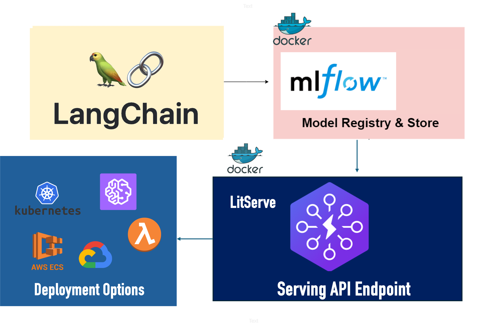
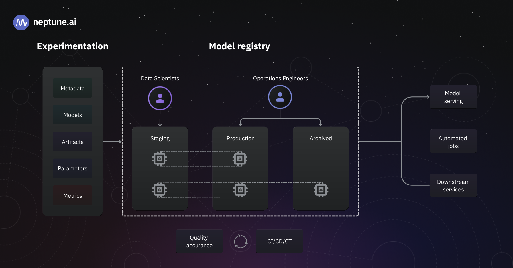

# ML Serving Endpoint with LitServe

This project sets up a FastAPI server using `litserve` that loads the latest MLflow model from the model registry and runs inference on it. The server includes input and output validations using Pydantic and can scale well to CPU/GPU workloads with batch capability.


## ML Design Pattern
In this example we will be looking at a realistic LLMOps example where we are loading a langchain  model from a model registry and serving it in a LitServe container




## MLflow Model Registry

MLflow Model Registry is a centralized repository to manage and deploy machine learning models. It provides model lineage, versioning, and lifecycle management. Models can be registered, and different versions of the model can be tracked and deployed.




## Loading Model from Registry

The server loads the latest model from the MLflow model registry. This pattern ensures that the most recent and validated model is always used for inference. The model is loaded at the server startup and is ready to serve predictions.


## Server Details

The FastAPI server (`litserve`) is designed to handle various workloads, including CPU and GPU, and supports batch processing for efficient inference. Input and output data are validated using Pydantic to ensure data integrity and correctness.

## Deployment

You can choose to deploy this on kubernetes or your cloud provider as well as at the edge.

## Instructions

## Setup ENV File
Setup an .env file with the following variables

```.env
# For Running the model
OPENAI_API_KEY= ... # or any other provider API  key if needed

# If your MLflow tracking server is on AWS
AWS_ACCESS_KEY_ID= ...
AWS_SECRET_ACCESS_KEY= ...
AWS_REGION= ...

```
### Build the Docker Image

To build the Docker image, run the following command:

```sh
docker build --build-arg GUARDRAILS_TOKEN=$(grep GUARDRAILS_TOKEN .env | cut -d '=' -f2) -t litserve-model:latest .
```
### Run the Docker Image

To run the Docker image, use the following command:

```sh
docker run --env-file .env -p 8000:8000 litserve-model:latest
```


